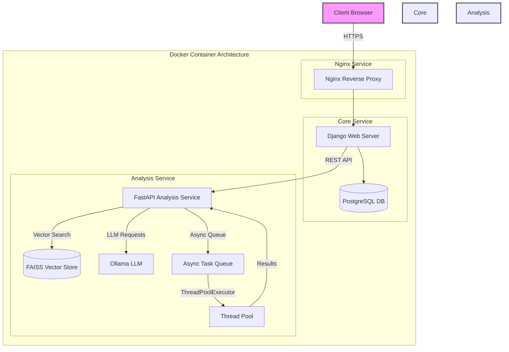
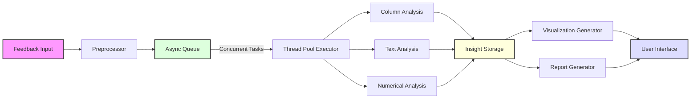

# Feedback Management System 🎯

A sophisticated feedback analysis platform built with Python and Django, leveraging AI-powered insights to transform raw feedback data into actionable intelligence.

[](https://python.org)
[](https://djangoproject.com)
[](https://fastapi.tiangolo.com)
[](https://www.docker.com/)
[](LICENSE)

## 📊 System Architecture

### High-Level Architecture



### Task Processing Architecture


## 🚀 Features

### Core Features
- **Multi-User Support**
  - Admin: Complete system control and analytics
  - Teachers: Class management and feedback analysis
  - Students: Feedback submission and tracking
  - Public: Access to public statistics

- **AI-Powered Analysis**
  - Sentiment analysis using LangChain
  - Pattern recognition in feedback
  - RAG-based contextual understanding
  - Automated insight generation

- **High-Performance Architecture**
  - FastAPI-powered analysis service
  - Async task processing
  - Concurrent analysis with ThreadPoolExecutor
  - Efficient FAISS vector search

### Technical Features
- **Containerized Architecture**
  - Multi-container Docker setup
  - Nginx reverse proxy
  - Independent service scaling
  - Container health monitoring

- **Normalized Database**
  - 5NF compliant schema
  - Optimized query performance
  - Referential integrity
  - Transactional consistency

- **Async Processing**
  - Custom async task queue
  - Parallel column analysis
  - Configurable concurrency limits
  - Task status tracking

## 🛠️ Technology Stack

### Backend
- Django 5.2 (Core Service)
- FastAPI 0.115.12 (Analysis Service)
- PostgreSQL (5NF Database)
- FAISS (Vector Storage)
- Ollama (LLM Integration)

### Infrastructure
- Docker Compose
- Nginx
- Gunicorn (WSGI Server)
- Uvicorn (ASGI Server)

### Tools & Libraries
- LangChain
- Pandas & NumPy
- ThreadPoolExecutor
- AsyncIO

## 🔧 Installation

### Using Docker (Recommended)

1. Clone the repository:
```bash
git clone https://github.com/sathwikshetty33/FeedbackManagementSystem.git
cd FeedbackManagementSystem
```

2. Create environment files:
```bash
cp .env.example .env
# Edit .env with your configuration
```

3. Start services:
```bash
docker-compose up -d
```

### Manual Installation

1. Install dependencies:
```bash
python -m venv venv
source venv/bin/activate  # On Windows use: venv\Scripts\activate
pip install -r requirements.txt
```

2. Start core service:
```bash
cd core
python manage.py migrate
python manage.py runserver
```

3. Start analysis service:
```bash
cd analysis-service
uvicorn app:app --workers 4
```

## 📊 Async Task Processing

The system uses a custom async task processing architecture:

- **Task Manager**
  - Async queue for task management
  - Configurable concurrency limits
  - Task status tracking and monitoring
  - Error handling and recovery

- **Parallel Processing**
  - ThreadPoolExecutor for CPU-bound tasks
  - Concurrent column analysis
  - Efficient resource utilization
  - Automatic load balancing

- **Task Types**
  - Feedback Analysis (High Priority)
  - Text Processing (Medium Priority)
  - Report Generation (Low Priority)

## 💾 Database Schema

The database follows 5NF principles with these main entities:

- Users (Admin, Teachers, Students, Public)
- Feedback Events
- Responses
- Analysis Results
- System Configurations

Each entity is fully normalized to:
- Eliminate redundancy
- Ensure data integrity
- Optimize query performance
- Support complex relationships

## 🔐 Security Features

- Token-based authentication
- Role-based access control
- Rate limiting
- SQL injection protection
- XSS prevention

## 🤝 Contributing

1. Fork the repository
2. Create your feature branch (`git checkout -b feature/AmazingFeature`)
3. Commit your changes (`git commit -m 'Add AmazingFeature'`)
4. Push to the branch (`git push origin feature/AmazingFeature`)
5. Open a Pull Request

## 📝 License

This project is licensed under the MIT License - see the [LICENSE](LICENSE) file for details.

## 📧 Contact

Sathwik Shetty - [@sathwikshetty33](https://github.com/sathwikshetty33)

Project Link: [https://github.com/sathwikshetty33/FeedbackManagementSystem](https://github.com/sathwikshetty33/FeedbackManagementSystem)

---
Last Updated: 2025-06-05 17:42:06 UTC
